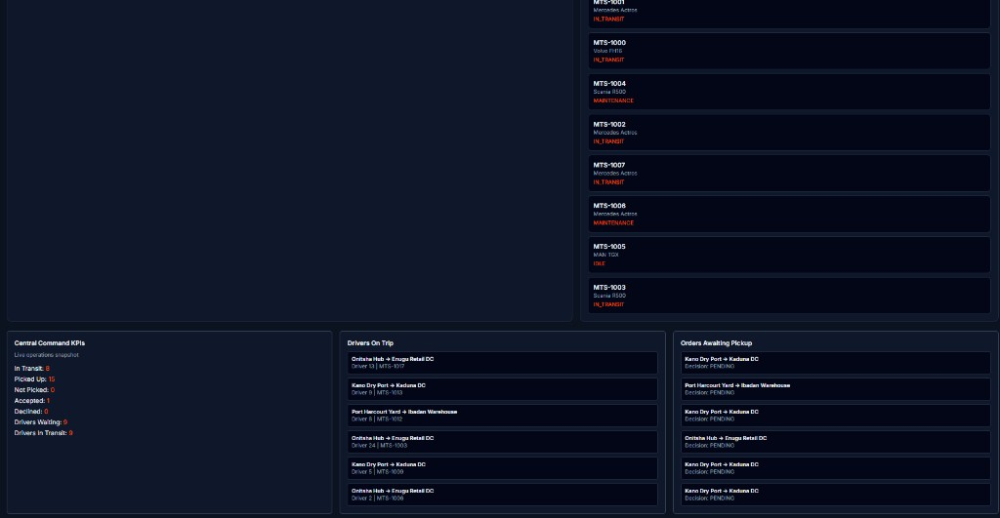

# MTS-Logistics

## Project Overview

I built **MTS-Logistics** as a cloud-native, multi-tenant SaaS platform for logistics and fleet operations.  
The goal is to provide a production-style system where each company runs independently with strict tenant isolation, role-based workflows, and real-time operational visibility.

## What I Built

- **Multi-tenant backend architecture** with tenant-scoped data access
- **Role-based authentication** for Super Admin, Admin, Dispatcher, and Driver
- **Dispatch workflow engine** (dispatch -> accept/decline -> complete trip)
- **Real-time fleet tracking** with WebSockets and live map support
- **Command-center dashboards** for tenant operations and platform oversight
- **Kenya-focused logistics data model** with Nairobi-first map and route context

## Tech Stack

- **Frontend:** React (Vite), Tailwind CSS, Recharts, Leaflet
- **Backend:** NestJS (TypeScript), Passport JWT, Socket.io
- **Database:** PostgreSQL + Prisma ORM
- **Caching / Queue-ready layer:** Redis
- **DevOps:** Docker Compose, GitHub Actions CI/CD

## Core Product Capabilities

### Tenant Isolation

- Shared database with discriminator-column tenancy strategy
- `tenantId` scoping enforced at request and query levels
- Middleware + interceptor architecture to prevent cross-tenant leakage

### Role Workflows

- **Driver:** sees assigned/nearby orders, accepts or declines jobs, completes deliveries
- **Dispatcher:** dispatches orders and monitors driver decisions
- **Admin:** sees fleet status, order lifecycle, and command-center KPIs
- **Super Admin:** sees platform-wide tenant and operations health

### Operations Visibility

- Live command center with:
  - in-transit orders
  - picked / not picked orders
  - accepted / declined decisions
  - drivers waiting / drivers on delivery
  - fleet activity and trip completion insights

## Dashboard Preview

## Key API Endpoints

### Auth

- `POST /auth/register-tenant`
- `POST /auth/login`
- `POST /auth/bootstrap-super-admin`
- `GET /auth/me`

## Visual Design Direction

- **Primary:** International Orange `#FF4F00`
- **Background:** Slate 950 `#020617`
- **Typography:** Inter
- **UI style:** Industrial high-contrast, modern command-center layout
